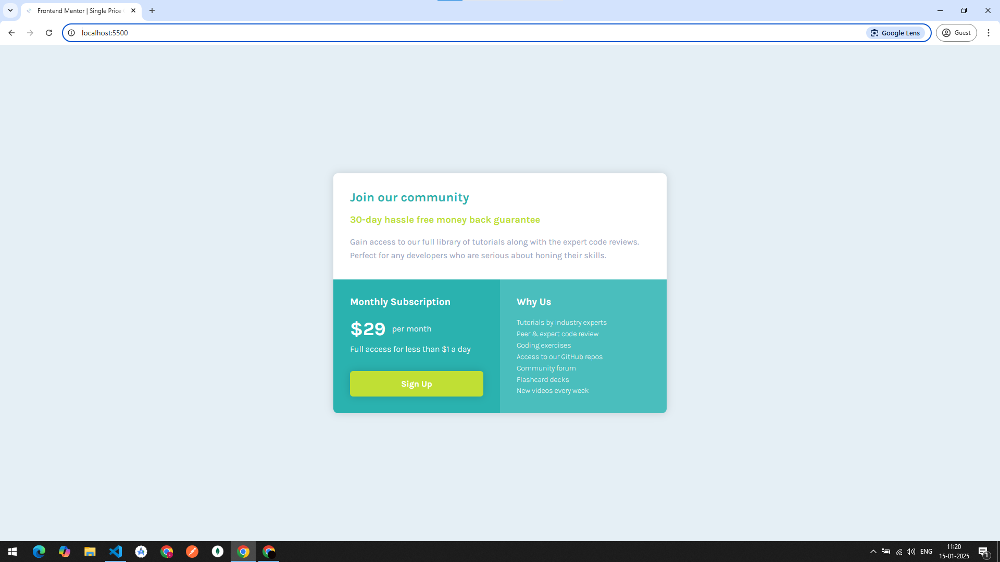

# Frontend Mentor - NFT preview card component

In this project, I have gained some confidence in building some CSS related concepts expecially working with CSS Grid. As a Beginner in CSS Grid I have understood the CSS GRID layout.


## Things I applied from my learning

1. CSS Grid Layout and have avoided unwanted flex box creation in the first step.
1. Have confidence in breaking the design and most importantly applying the responsiveness more intact way.😎
1. This coding practice is very crucial for my web development career understanding the design is more important in building this kind of web components.

## CODE BLOCK I'm feeling nice

```
@media (max-width: 580px) {
  #root {
    /* Fonts or Typography */
    font-size: 12px;
    max-width: 280px;
    grid-template-columns: 1fr;
  }

  .note {
    padding: 1.45em;
  }

  h3.sub-headline {
    font-weight: 500;
    font-size: 1.25em;
  }
}
```

## ScreenShots

> Note about the ScreenShot

This is one of my screenshot for the Work I did.😁


## Things I learned:

1. I have learnt to make use of CSS `Grid`.
1. Understood the breaking process of design into code.`.

## Things I am planning to do:

1. I want to incorporate frontend libraries in my project in the future. Especially ReactJS.
1. WCAG - requirements and guidelines for Responsive Web Design.
1. Dynamic Website using Java Script. Data Driven Architecture using React or Vanilla JS
1. Probably using TypeScript.

### IMPORTANT LINKS

| Source    | Link                                                                                 |
| --------- | ------------------------------------------------------------------------------------ |
| Live Site | [URL for GitHub Page](https://logeshwaran123.github.io/single-price-grid-component/) |
| Code URL  | [Repo in GitHub](https://github.com/Logeshwaran123/single-price-grid-component.git)  |
